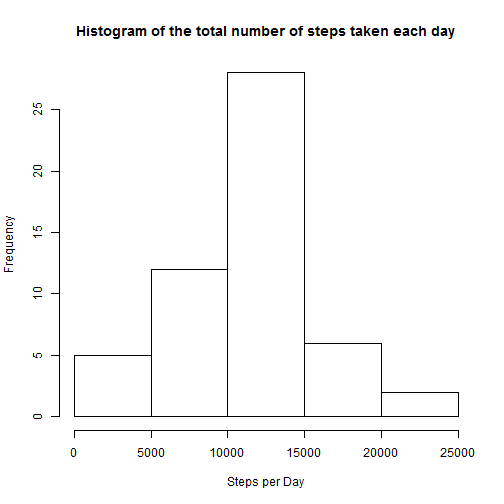
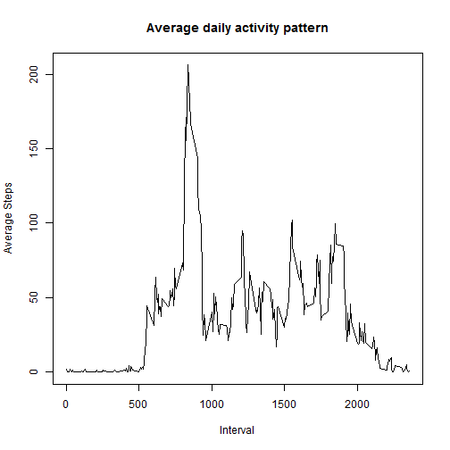
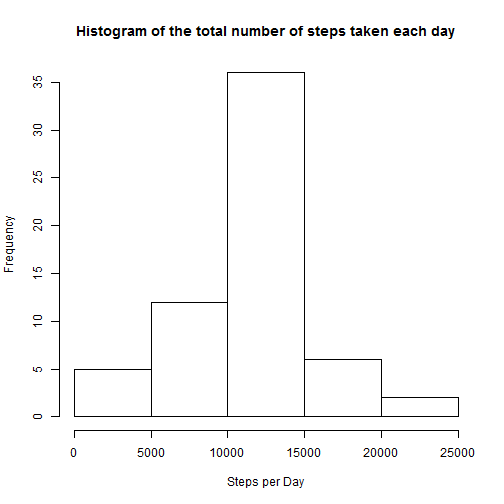
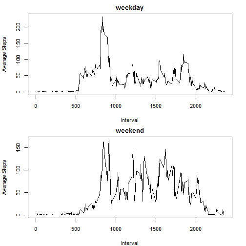

# Reproducible Research: Peer Assessment 1


## Loading and preprocessing the data


```r
data <- read.csv("activity.csv")

head(data)
```

```
##   steps       date interval
## 1    NA 2012-10-01        0
## 2    NA 2012-10-01        5
## 3    NA 2012-10-01       10
## 4    NA 2012-10-01       15
## 5    NA 2012-10-01       20
## 6    NA 2012-10-01       25
```

```r
nrow(data)
```

```
## [1] 17568
```

```r
nrow(subset(data, is.na(steps)))
```

```
## [1] 2304
```


## What is mean total number of steps taken per day?


```r
steps_per_day <- aggregate(steps ~ date, data, sum)
hist(steps_per_day$steps, main = "Histogram of the total number of steps taken each day", 
    xlab = "Steps per Day", ylab = "Frequency")
```

 


```r
mean1 <- mean(steps_per_day$steps)
```


The mean is ``10766.1886792453`` steps per day.


```r
median1 <- median(steps_per_day$steps)
```


The median is ``10765`` steps per day.

## What is the average daily activity pattern?


```r
steps_per_interval <- aggregate(steps ~ interval, data, mean)
summary(steps_per_interval)
```

```
##     interval        steps       
##  Min.   :   0   Min.   :  0.00  
##  1st Qu.: 589   1st Qu.:  2.49  
##  Median :1178   Median : 34.11  
##  Mean   :1178   Mean   : 37.38  
##  3rd Qu.:1766   3rd Qu.: 52.83  
##  Max.   :2355   Max.   :206.17
```

```r
plot(steps_per_interval$steps ~ steps_per_interval$interval, type = "l", main = "Average daily activity pattern", 
    xlab = "Interval", ylab = "Average Steps")
```

 


```r
max_steps <- max(steps_per_interval$steps)
tmp <- subset(steps_per_interval, steps == max_steps)
tmp$interval
```

```
## [1] 835
```


5-minute interval which contains the maximum number of steps is ``835``.


## Imputing missing values


```r
tmp <- nrow(subset(data, is.na(steps)))
```


The total number of missing values in the dataset is ``2304``.


```r
data2 <- data
steps_per_interval2 <- aggregate(steps ~ interval, data2, mean)

for (i in 1:nrow(data2)) {
    # If the steps column is NA, fill it with average value.
    if (is.na(data2[i, c("steps")])) {
        # interval
        j = data2[i, 3]
        
        # fetch a record from the average data set, and fill an empty 'steps' with
        # it.
        avg_row <- subset(steps_per_interval2, interval == j)
        avg_steps <- avg_row[1, 2]
        data2[i, 1] <- avg_steps
    }
}

nrow(data2)
```

```
## [1] 17568
```

```r

tmp <- nrow(subset(data2, is.na(steps)))
```


Now, the total number of missing values in the dataset is ``0``.


```r
steps_per_day2 <- aggregate(steps ~ date, data2, sum)
hist(steps_per_day2$steps, main = "Histogram of the total number of steps taken each day", 
    xlab = "Steps per Day", ylab = "Frequency")
```

 


```r
mean2 <- mean(steps_per_day2$steps)
```


The mean is ``10766.1886792453`` steps per day.


```r
median2 <- median(steps_per_day2$steps)
```


The median is ``10766.1886792453`` steps per day.

So, here is the differences.

According to the histgrams, the frequency of the 10000-15000 class is increased.

And


```r
mean_diff <- mean2 - mean1
```


the mean is differed ``0`` steps from the first one.


```r
median_diff <- median2 - median1
```


Also the median is differed ``1.1887`` steps from the first one.


## Are there differences in activity patterns between weekdays and weekends?


```r
# changing locale stuff because running Rstudio in Japanese environment
Sys.setlocale(category = "LC_TIME", locale = "C")
```

```
## [1] "C"
```

```r
Sys.setlocale(category = "LC_ALL", locale = "C")
```

```
## [1] "C"
```

```r

for (i in 1:nrow(data2)) {
    if (weekdays(as.Date(data2[i, c("date")])) %in% c("Saturday", "Sunday")) {
        data2[i, c("weekday")] <- "weekend"
    } else {
        data2[i, c("weekday")] <- "weekday"
    }
}

data_weekday <- subset(data2, weekday == "weekday")
data_weekend <- subset(data2, weekday == "weekend")

par(mfrow = c(2, 1), ps = 11, mar = c(4, 4, 2, 2))

steps_per_interval_weekday <- aggregate(steps ~ interval, data_weekday, mean)
plot(steps_per_interval_weekday$steps ~ steps_per_interval_weekday$interval, 
    type = "l", main = "weekday", xlab = "Interval", ylab = "Average Steps")

steps_per_interval_weekend <- aggregate(steps ~ interval, data_weekend, mean)
plot(steps_per_interval_weekend$steps ~ steps_per_interval_weekend$interval, 
    type = "l", main = "weekend", xlab = "Interval", ylab = "Average Steps")
```

 

